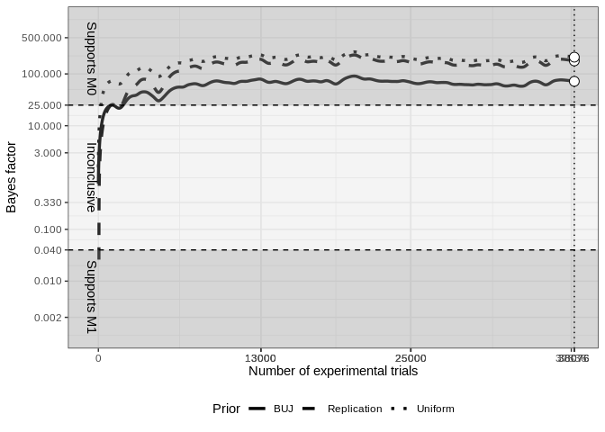
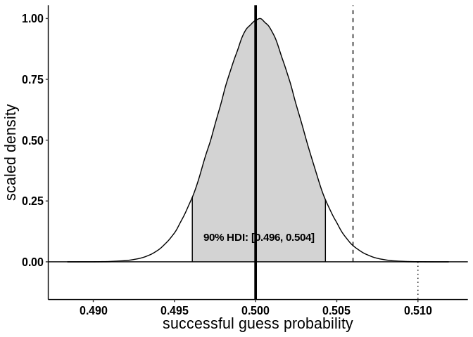
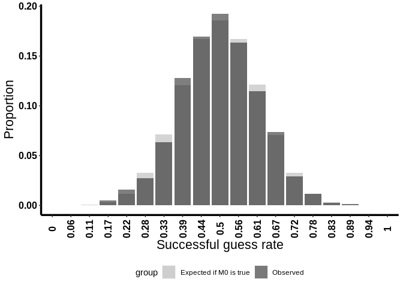

<!-- README.md is generated from README.Rmd. Please edit that file -->

# transparent-psi-results

<!-- badges: start -->

<!-- badges: end -->

This repository contains the data collected for the [Transparent Psi
Project](https://osf.io/jk2zf/). This README contains the results
calculated from the currently available data. The document was last
updated at 2022-04-08.

Result not yet final\! Data presented on this page represent the current
trend calculated from the data. The results should not be
over-interpreted\! Random variations may cause the data to cross the
decision thresholds. Statistical decisions will only be drawn at the
pre-specified stopping points. The next stopping point will be at
reaching 37836 trials.

# Summary of the results

The study currently has 37193 erotic trials gathered from a total of
2081 participants. There has been 33 incomplete study sessions so far
resulting in a total of 265 (0.71%) missing data points due to
incomplete sessions. We observed a total of 49.86% successful guesses
within 37193 erotic trials (posterior mode = 49.99%, posterior 90% HDI =
49.56%, 50.39%).

# Main Confirmatory Analysis results

<!-- -->

# Result of the Bayesian Parameter Estimation Robustness Analysis

<!-- -->

# Histogram overlay of the expected and observed distribution of successful guess rate

<!-- -->
